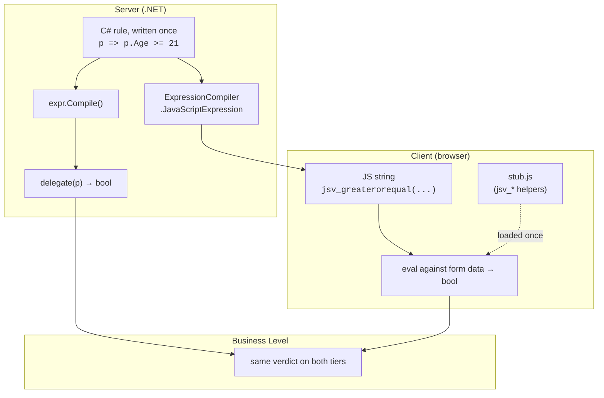

# Gehtsoft.ExpressionToJs

Compile a C# `LambdaExpression` into an equivalent **JavaScript expression string** — so the same
predicate can run on the server (as a normal compiled delegate) **and** in the browser (as the
emitted JS), from a single source of truth.

## Why this exists

Form validation usually gets written twice: once in C# for the server and once in JavaScript for
the client. The two drift apart, and users hit "valid here, invalid there" bugs.

This library removes the second copy. You write the rule **once** as a C# expression:

```csharp
profile => Functions.YearsSince(DateTime.Today, profile.BirthDate) >= 21
```

- On the **server** you compile and invoke it like any `Func<>` — `expr.Compile()(profile)`.
- For the **client** you hand the expression to `ExpressionCompiler`, which emits JavaScript that
  computes the same result. Ship that string to the page, evaluate it, and the browser enforces the
  identical rule.

The emitted code is just an *expression* (typically boolean), not a program — ideal for validation
predicates, conditional visibility, computed flags, and similar "is this OK?" checks.

## How it works

You author the rule once as a C# expression. On the server it is compiled to a delegate and invoked
directly, like any `Func<>`. For the client, `ExpressionCompiler` walks the same expression tree and
emits an equivalent JavaScript string; that string is served to the page and evaluated against the
form data. Both tiers compute the same boolean verdict from the one definition — that shared verdict
is the whole point.

The emitted JS calls small runtime helpers named `jsv_*` (e.g. `jsv_greater`, `jsv_equal`,
`jsv_match`). Those live in **`stub.js`**, shipped inside the assembly as an embedded resource;
the host page must include it once before evaluating any compiled expression. The helpers exist so
that JavaScript reproduces C# semantics (integer division, rounding, typed equality, date handling)
rather than JS's looser defaults.



## Quick start

```csharp
using System.Linq.Expressions;
using Gehtsoft.ExpressionToJs;

// 1. Write the rule once, in C#.
Expression<Func<int, bool>> rule = x => x > 0 && x < 100;

// 2. Server side: run it directly.
bool ok = rule.Compile()(42);                 // true

// 3. Client side: compile it to JavaScript.
string js = new ExpressionCompiler(rule).JavaScriptExpression;
// js == "((jsv_greater(x, 0)) && (jsv_less(x, 100)))"

// 4. The JS runtime the emitted code needs (serve this to the browser once).
string stub = ExpressionToJsStubAccessor.GetJsIncludesAsString();
```

In the browser you load `stub`, bind the variables the expression references (here `x`), and
evaluate `js` — it returns the same boolean the server computed.

## Practical examples

All snippets below are real compiler output (the `jsv_*` calls resolve against `stub.js`).

### A string / regex rule

```csharp
Expression<Func<Profile, bool>> email =
    p => Regex.IsMatch(p.Email, "^.+@.+$");

// jsv_match(/^.+@.+$/, p.Email)
```

### A date rule (evaluated at validation time, not compile time)

```csharp
Expression<Func<Profile, bool>> adult =
    p => Functions.YearsSince(DateTime.Today, p.BirthDate) >= 21;

// jsv_greaterorequal(jsv_yearssince(jsv_today(false), p.BirthDate, false), 21)
```

`DateTime.Today` / `Now` / `UtcNow` stay dynamic — they become `new Date()` / `jsv_today(...)` so
the rule is checked against the clock when the user submits, exactly like the server.

### A collection rule (LINQ)

```csharp
Expression<Func<Profile, bool>> hasAdmin =
    p => p.Roles.Any(r => r == "admin");

// jsv_any(p.Roles, function (r) { return (jsv_equal(r, 'admin')); })
```

`Any`/`All`/`Count`/`First`/`Where`/`Select`/`Sum`/`Min`/`Max`/`Distinct` and friends are
supported, including chained pipelines.

### Server/client parity helper methods

Some operations have no direct BCL ⇄ JS equivalent, so the library ships matched pairs: a C#
`Functions.X` and a behaviorally identical `jsv_x` in the stub. Examples: `YearsSince` /
`MonthsSince` / `DaysSince`, `IsCreditCardNumberCorrect` (Luhn), `ToBool`, `ToInt`, `Fractional`,
`IsNull` / `IsNotNull`. Call `Functions.X(...)` in your C# rule and the emitted JS calls the
matching `jsv_x(...)`.

### Customizing the form-validation binding

By default a parameter `p` is emitted verbatim (`p.Age`). For the validation use case you usually
want member access to resolve against the form instead, through a host-provided `reference()` hook.
Turn that on with the `Parameters` registry — no subclassing:

```csharp
var compiler = new ExpressionCompiler(rule);
compiler.Parameters.MapReference(_ => true);   // off by default; this enables it for the model

// p => p.Address.PostalCode.Length == 5
//   becomes:  jsv_equal(jsv_length(reference('Address.PostalCode')), 5)
```

The host page provides `reference(path)` (walk the model) and the rule runs unchanged. Use
`Parameters.Map(...)` (with the public `ExpressionCompiler.ParameterAccessPath` helper) to emit a
different shape — e.g. `value.Property` object access, or `reference('Type', 'path')` when a page
hosts more than one form. The sample
[`ValidationExpressionCompiler`](Gehtsoft.ExpressionToJs.Tests/ValidationExpressionCompiler.cs)
shows the older subclassing approach.

### Extending without subclassing

Register custom translations per compiler instance:

```csharp
var compiler = new ExpressionCompiler(rule);

compiler.Methods.MapMethod(typeof(MyMath), nameof(MyMath.Clamp), "jsv_clamp($0, $1, $2)");
compiler.Constants.MapConstant<Guid>(g => "'" + g + "'");
compiler.Members.MapMember(typeof(Money), nameof(Money.Amount), "$obj.amount");
compiler.Parameters.MapReference(_ => true);   // model fields -> reference('path')
```

User registrations are consulted before the built-ins, so they can also shadow defaults.

### Local vs UTC dates

```csharp
var compiler = new ExpressionCompiler(rule, DateTimeMode.Utc);   // or set compiler.DateMode
```

`DateTimeMode` selects how calendar constructs are emitted (`getFullYear()` vs `getUTCFullYear()`,
etc.). The contract: bind JS-side dates in the same frame you select here.

## Project layout

```
Gehtsoft.ExpressionToJs/              the library (netstandard2.0)
├── ExpressionWalker.cs               ExpressionCompiler — the core; walks the tree and emits JS
├── MethodTranslators.cs              method-call pipeline: Regex, IndexOf, StartsWith/EndsWith,
│                                     Contains, LINQ, indexer, ToString, DateDiff, + registries
├── ValueTranslators.cs              constant & member-access translators (incl. mode-aware dates,
│                                     Nullable<T>, the parameter-access fallback)
├── Functions.cs                      server-side C# helpers with no BCL equivalent
├── stub.js                           the client runtime: every jsv_* helper (embedded resource)
└── StubAccessor.cs                   loads stub.js from embedded resources

Gehtsoft.ExpressionToJs.Tests/        xUnit v3 tests, run on Jint (in-process JS engine)
├── Complete/                         differential suite — the bulk of the tests; each case checks
│                                     the compiled C# delegate, the emitted JS in Jint, and the two
│                                     against each other (operators, math, strings, LINQ, enums,
│                                     dates, the registries, the realistic profile scenario, …)
├── CompilerTest.cs                   original round-trip suite
└── ValidationExpressionCompiler.cs   sample subclass for the reference()/value validation use case
```

### Mental model of the compiler

`WalkExpression` recurses the tree: it constant-folds subtrees that have no free parameter and no
ambient-`now` accessor; operators map to `jsv_*` calls inline; and calls, member access and
constants dispatch through translator pipelines (user registrations → built-ins → throw). Most emit
methods are `protected virtual`, so a subclass can override any piece.

The server and client sides are kept equivalent **by hand** — every `Functions.X` must have a
matching `jsv_x` — and that contract is guarded by the differential test suite, which runs both
sides and compares them. The testing model is documented in
[`MODEL_FOR_TEST.md`](MODEL_FOR_TEST.md).

## Build & test

```bash
dotnet build Gehtsoft.ExpressionToJs.sln
dotnet test  Gehtsoft.ExpressionToJs.sln
```

Tests depend on `Jint` (an in-process JS engine, used to actually run the emitted JavaScript),
`xunit.v3`, and the .NET test SDK.

## License

Apache License 2.0 — see [LICENSE](../LICENSE).
